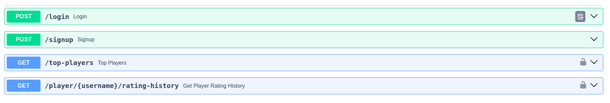

# Chess Player Rankings Project

## Overview

This project is a web application that showcases the top 50 chess players along with their current ratings. Additionally, it provides the user with the ability to view the last 50 rating history of a specific player.

### Technologies Used

- **Frontend:** React and Vite with Typescript
- **Backend:** FastAPI

## Installation

### Frontend

1. Navigate to the `frontend` directory.
   ```bash
   cd frontend
   bun install
   bun run dev
   ```
2.  Navigate to the `backend` directory.
    ```bash
    cd backend
    pip install -r requirements.txt

    env variables you need to definie
    SECRET_KEY = "your SECRET_KEY "
    ALGORITHM = "HS256"
    SQLALCHEMY_DATABASE_URL = "postgresql://your_user_name:your
    _passwordlocalhost:5432/db_name"

    Activate the virtual environment.
    For Windows:
    venv\Scripts\activate
    For macOS/Linux:
    source venv/bin/activate

    ```
Usage
Open the web application in your browser (http://localhost:5173).
The homepage will display the top 50 chess players with their current ratings.
Click on a specific player to view their last 50 rating history.

API Endpoints

